# myapp

## 目的
Firebaseについての使い方を学び、FlutterとFirebaseを使ったアプリ構築を練習する

---
## Firebaseとは
---

FirebaseはGoogleが提供しているモバイルアプリ・Webアプリの開発に役立つ機能を持つプラットフォーム

---
## Firebaseの機能
---
- Authentication

    Authenticationはユーザーを簡単かつ安全に認証する仕組みを提供するもの。 メールアドレス・電話番号・Googleアカウント等を使ったログイン機能が簡単に作ることが出来る。

- Cloud Firestore
  
    Cloud Firestoreはアプリのデータを保存・同期する仕組みを提供するデータベース。 アプリのデータを簡単に保存・取得したり、複数の端末でデータを同期する機能が簡単に作れる。

- Hosting
  
    Hosting はWebアプリを配信するための機能を提供するもの。 Webアプリを簡単にデプロイし、素早くWebアプリを公開することができる。

- その他
  
    この他にもたくさんの機能があります。 詳細は参考内のFirebase公式を参照。
---
## FlutterとFirebaseを使ったアプリ作成
---
### アプリの構成イメージ

## 参考
- [Flutterで始めるアプリ開発](https://www.flutter-study.dev/)
- [Firebase公式](https://firebase.google.com/products-build?hl=ja#develop-products)

